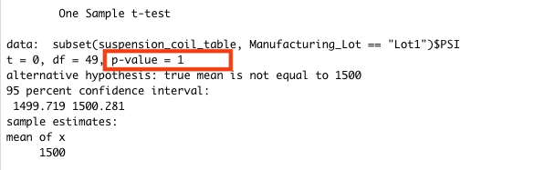

# MechaCar_Statistical_Analysis

## Linear Regression to Predict MPG
The output of the analysis looks like the following image:

 

- In the summary output, we can see that according to our results, vehicle length and ground clearance are  non-random amount of variance to the mpg values in the dataset.
- linear regression analysis's p-value is 5.35e-11, which is substantially lower than the significance level of 0.05% that we assumed it to have. This suggests that the slope of our linear model is not zero, and we can say that there is enough evidence to reject our null hypothesis.
- significant intercept could mean that the significant features (vehicle length and ground clearance) may need scaling or transforming to help improve the predictive power of the model.

## Summary Statistics on Suspension Coils

   

The manufacturing data meets the design specifications because the variance of the coils 62 PSI which is in 100 PSI requirement. Lot 1 and 2 are within the variance requirement lot3 is not, it is showing the larger variance 170 PSI which is not within the design specification.

## T-Tests on Suspension Coils

### T-test for all manufacturing lots 
After analysing the t-test for all manufacturing lots the p-value is 0.06028. This is higher then the common significants of 0.05.

### T-test for individual manufacturing lots 
After seeing the performance of all manufacturing lots, we will be rewieving the individual lots.

### 1 T-test for manufacturing lot1
The t-test for manufacturing lot1 has the p-value of 1. We can not reject the null hypothisis because there is no statistical difference between the observed sample mean and the population mean.

### 2 T-test for manufacturing lot2
The t-test for manufacturing lot2 has the p-value of 0.6072. The observed sample mean is almost the same as the population mean which provides no reason to reject the null hypothesis.

### 3 T-test for manufacturing lot3
The t-test for manufacturing lot1 has the p-value of 0.04168. The p-value is lower then the common significance level which means we should reject the null hypithisis.

## Study Design: MechaCar vs Competition

After completed multiple statistical studies to compare performance of the MechaCar against other cars from other manufactures. We can now complete study between MechaCar and their competitors. 

What metric or metrics are you going to test?
Cost, fuel efficiency, safety rating, engine type, upgrade features

What is the null hypothesis or alternative hypothesis?
Null hypothesis, MechaCar has no difference in pricing compered to its competitors based on it performance of key factors.

Alternative hypothesis, MechaCar has a difference in pricing compered to its competitors based on it performance of key factors.

What statistical test would you use to test the hypothesis? And why?
Using multiple linear regressions can determine the factors that have the highest correlation with a dependent factor like price.

What data is needed to run the statistical test?
We would need to more data on the metrics for MechaCar and its competitors.